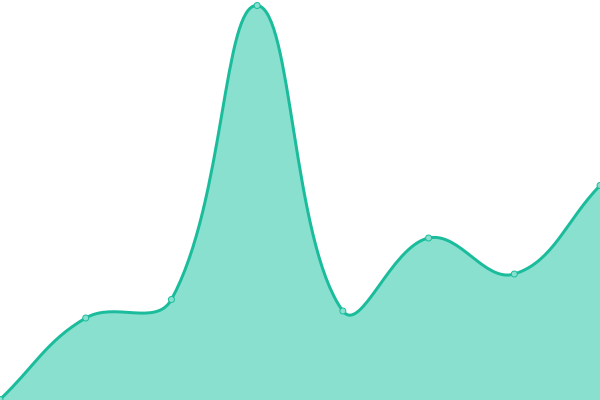

# [📈 Live Status](https://uptime.rb9.xyz): <!--live status--> **🟩 All systems operational**

This repository contains the open-source uptime monitor and status page for [Joe Leaver](https://radialbog9.uk), powered by [Upptime](https://github.com/upptime/upptime).

With [Upptime](https://upptime.js.org), you can get your own unlimited and free uptime monitor and status page, powered entirely by a GitHub repository. We use [Issues](https://github.com/TheJoeCoder/uptime/issues) as incident reports, [Actions](https://github.com/TheJoeCoder/uptime/actions) as uptime monitors, and [Pages](https://uptime.rb9.xyz) for the status page.

<!--start: status pages-->
<!-- This summary is generated by Upptime (https://github.com/upptime/upptime) -->
<!-- Do not edit this manually, your changes will be overwritten -->
<!-- prettier-ignore -->
| URL | Status | History | Response Time | Uptime |
| --- | ------ | ------- | ------------- | ------ |
|  [Radialbog9](https://radialbog9.uk) | 🟩 Up | [radialbog9.yml](https://github.com/TheJoeCoder/uptime/commits/HEAD/history/radialbog9.yml) | 

 853ms
     
 | 

<a href="https://uptime.rb9.xyz/history/radialbog9">100.00%</a>
    

|  [Minecraft Hosting Panel](https://panel.mc.radialbog9.uk) | 🟩 Up | [minecraft-hosting-panel.yml](https://github.com/TheJoeCoder/uptime/commits/HEAD/history/minecraft-hosting-panel.yml) | 

 1417ms
     
 | 

<a href="https://uptime.rb9.xyz/history/minecraft-hosting-panel">100.00%</a>
    

|  [Minecraft Hosting - Node 1](node1.mc.radialbog9.uk) | 🟩 Up | [minecraft-hosting-node-1.yml](https://github.com/TheJoeCoder/uptime/commits/HEAD/history/minecraft-hosting-node-1.yml) | 

 330ms
     
 | 

<a href="https://uptime.rb9.xyz/history/minecraft-hosting-node-1">100.00%</a>
    

|  [Radialbog9 MC](play.mc.radialbog9.uk) | 🟩 Up | [radialbog9-mc.yml](https://github.com/TheJoeCoder/uptime/commits/HEAD/history/radialbog9-mc.yml) | 

 116ms
     
 | 

<a href="https://uptime.rb9.xyz/history/radialbog9-mc">100.00%</a>
    

<!--end: status pages-->

[**Visit our status website →**](https://uptime.rb9.xyz)

## 📄 License

- Powered by: [Upptime](https://github.com/upptime/upptime)
- Code: [MIT](./LICENSE) © [Joe Leaver](https://radialbog9.uk)
- Data in the `./history` directory: [Open Database License](https://opendatacommons.org/licenses/odbl/1-0/)
